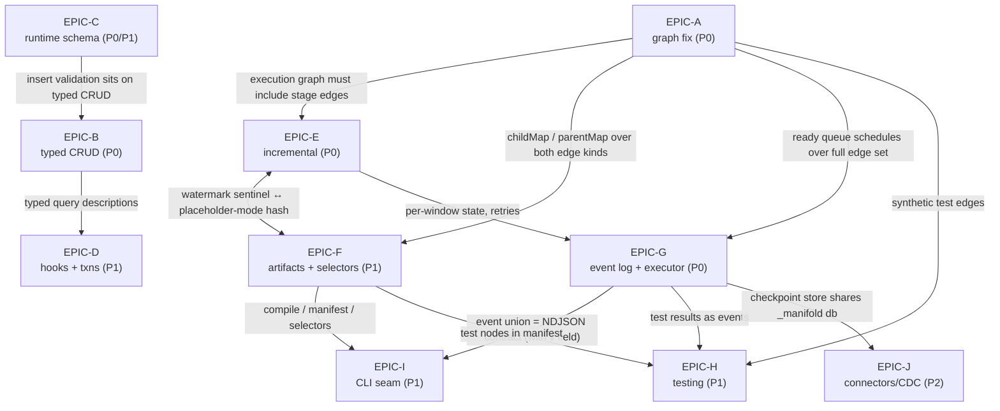

# TRD Index — PipeSafe Competitive Roadmap (Phase 3)

Ten ticket-level TRDs turning the phase-2 roadmap docs (`plan/00`–`06`) into epics. Each TRD carries a **Spike findings** section recording what its executed spike proved or disproved; those sections are the evidence record and are not edited after the fact. Where an executed spike contradicted a phase-2 doc, the doc has been corrected in place with a pointer back to the TRD, and the change is logged in the **Reconciliation ledger** below.

## Epic index

| TRD                                                                        | Tickets   | Priority band        | Scope                                                                                                  | Spike(s) → verdict                                                                                                                                                                                                                                                                                                                                                               |
| -------------------------------------------------------------------------- | --------- | -------------------- | ------------------------------------------------------------------------------------------------------ | -------------------------------------------------------------------------------------------------------------------------------------------------------------------------------------------------------------------------------------------------------------------------------------------------------------------------------------------------------------------------------- |
| [EPIC-A-dependency-graph-fix.md](EPIC-A-dependency-graph-fix.md)           | GRAPH ×6  | P0 (GRAPH-5 P1)      | Make lookup/unionWith edges first-class in `Project` ordering, targets, and cycle detection.           | `graph-fix.spike.ts` (executed) → mis-ordering confirmed empirically (silently-empty joins, `success: true`); lookup cycles **stack-overflow at construction**, adding a fourth fix site (cycle-safe discovery); unified-edge fix demonstrated end-to-end.                                                                                                                       |
| [EPIC-B-typed-crud.md](EPIC-B-typed-crud.md)                               | CRUD ×11  | P0 (P1/P2 tail)      | Retype `Collection` CRUD with PipeSafe machinery: filters, projections, update operators, narrowing.   | `typed-crud-real.spike.ts` (executed against real dist types) → plain `<const F extends MatchQuery>` leaks typo'd paths on array-bearing schemas; `ValidateMatchKeys` intersection fixes it; value-position update-operand brands beat key restriction; compile-perf risk did not materialize. `orm-crud-api.spike.ts` (sketch) partially superseded.                            |
| [EPIC-C-runtime-schema-validation.md](EPIC-C-runtime-schema-validation.md) | SCHEMA ×7 | P0/P1                | Standard Schema in, `$jsonSchema` out; insert validation, defaults, type-visible timestamps, sync.     | `standard-schema-jsonschema.spike.ts` (executed vs mongod 7.0.24) → generic `deriveJsonSchema` is **unimplementable** (no introspection API); per-vendor adapters required; server 121/`errInfo`, warn-invisibility, moderate-level semantics all pinned. `orm-schema-api.spike.ts` (sketch) §3 superseded.                                                                      |
| [EPIC-D-hooks-transactions.md](EPIC-D-hooks-transactions.md)               | HOOKS ×6  | P1 (HOOKS-5 P2)      | Typed interceptors (Prisma-extensions shape) + ALS ambient transactions with our own retry policy.     | `als-transactions.spike.ts` (executed vs replset) → mechanism is ~15 lines and works across all async shapes; driver retry loop is time-bounded (~120 s) with no backoff → own bounded retry (HOOKS-3); one-session concurrency needs an explicit policy.                                                                                                                        |
| [EPIC-E-incremental-models.md](EPIC-E-incremental-models.md)               | INC ×10   | P0/P0.5 (P1/P2 tail) | `Model.Mode.Incremental` + `Microbatch`: watermark context, `$merge` strategies, grain inference.      | `incremental-exec.spike.ts` (executed, 29/29) + `grain-inference.spike.ts` (executed) → unique index required before non-`_id` merge (51183); `Mode.Append` (`whenMatched: "fail"`) unsafe for reruns; auto-`$unset _id` needed; `ctx.watermark()` must be a sentinel; grouped models merge on `["_id"]`; grain inference is runtime-only.                                       |
| [EPIC-F-state-artifacts-selectors.md](EPIC-F-state-artifacts-selectors.md) | STATE ×8  | P1 (P2 tail)         | Manifest + run-results artifacts, canonical pipeline hash, `state:modified`/defer/retry, selectors.    | `pipeline-hash.spike.ts` (executed, 22/22) → naive JSON silently collides (RegExp, Date-vs-string, dropped functions) — tagged canonicalizer + throw-on-function required; hash the **unresolved** stages; selection algorithms proven as pure functions. `manifest-artifact.spike.ts` (sketch) canonicalizer superseded.                                                        |
| [EPIC-G-event-log-executor.md](EPIC-G-event-log-executor.md)               | LOG ×10   | P0 (P1/P2 tail)      | `_manifold` append-only event log + derived summary; ready-queue executor, retries, resume, staleness. | `event-log-exec.spike.ts` (executed vs replset) → per-run counter for `seq`; **non-transactional event-first** summary write chosen; crash/resume rebuilt purely from the log; found and fixed a **skip-propagation bug** in the sketch. `run-event-log.spike.ts` (sketch) superseded on that point.                                                                             |
| [EPIC-H-testing-framework.md](EPIC-H-testing-framework.md)                 | TEST ×6   | P1 (P2 tail)         | Data tests as pipelines (typed field args) + typed unit fixtures; tests as DAG nodes; `build`.         | `typed-unit-tests.spike.ts` (executed, 7/7) → dbt convention ports directly and stays typed; `$documents` is the fixture path; `not_null` on non-nullable fields needs internal raw-stage construction; core gap: `_id` cannot be stripped in-pipeline when the schema omits it.                                                                                                 |
| [EPIC-I-cli-host-seam.md](EPIC-I-cli-host-seam.md)                         | CLI ×6    | P1                   | `manifold` CLI: command grammar, exit codes, config loading, NDJSON stream, compile/manifest, recipes. | TRD-only (no runtime spike; grounded in the `run-event-log` / `manifest-artifact` sketches + repo facts) → event union needs a `v` version field; manifest filename standardized to `manifold-manifest.json`; CLI license is an open maintainer decision.                                                                                                                        |
| [EPIC-J-connectors-cdc.md](EPIC-J-connectors-cdc.md)                       | CONN ×9   | P2 (P3 tail)         | `ExternalSource<T>` contract, checkpoint store, change-stream CDC both directions, drift, Parquet.     | `change-stream-cdc.spike.ts` (executed vs replset) → snapshot-then-stream requires capturing `operationTime` **before** the snapshot (wrong order silently loses data); resume-token failure modes broader than planned → code-set matching + liveness watchdog; write-before-checkpoint verified loss-free. `source-connector-api.spike.ts` (sketch) error handling superseded. |

79 tickets total across the ten epics.

## Cross-epic dependency graph

Reading order for implementation: **A and G first** (A gates every graph consumer; G is the keystone the CLI, staleness, resume, and run-results all derive from), then E (P0 incremental) and B/C on the ORM side, then F/H/I (the P1 workflow layer), then D, then J.

## Reconciliation ledger

The authoritative list of what the **executed** spikes changed versus the phase-2 docs (`plan/00`–`05`). Each phase-2 doc has been corrected in place with a pointer; the TRD Spike findings sections hold the full evidence.

1. **Lookup cycles crash at construction, not "validate cleanly" (EPIC-A).** plan/01 §5.1(c) claimed `validate()` cannot detect lookup-edge cycles; plan/04 §2(3) claimed a lookup cycle "validates cleanly and deadlocks (or races) at run time". Empirically, constructor discovery (marks visited _after_ recursing) loops forever and throws `RangeError: Maximum call stack size exceeded` before `validate()` ever runs. Consequence: plan/04's three-site fix list is incomplete — **cycle-safe discovery is a fourth fix site** (GRAPH-2). Corollary: the from-only `detectCycle` is effectively dead code today.
2. **The mis-ordering bug produces silent wrong data, not just a "race" (EPIC-A).** The spike materialized empty lookup joins (`cDocs.length === 0` for every document) with the run reporting `success: true`, and `toMermaid()` omitting the edge. plan/01 §5.1(a) and plan/00 Wave 1 now state the wrong-data consequence.
3. **Generic `deriveJsonSchema(StandardSchemaV1)` is impossible (EPIC-C).** Standard Schema's `~standard` exposes only `validate()` — there is no introspection API and no "Standard Schema-adjacent metadata" (plan/03 §3's phrasing). Derivation must be **per-vendor adapters** dispatched on `~standard.vendor` (Zod v4 `z.toJSONSchema`, `@valibot/to-json-schema`, post-processed into Mongo's draft-4 dialect). Validation works for any vendor; validator derivation only for adapted vendors, with an explicit `bsonSchema` fallback (SCHEMA-3). `orm-schema-api.spike.ts` §3's generic deriver sketch is superseded.
4. **Event-log summary write is non-transactional by design (EPIC-G).** plan/05 §2 said the summary "is updated in the same transaction as the event append". The spike measured the transaction as slightly _faster_ (no cost argument either way), but the decision rests on correctness and reach: append the event first, then an idempotent summary upsert. A crash between the two leaves a stale summary that fails safe (the model just re-runs; materialization is idempotent) and is rebuildable from events — and the non-transactional path works on standalone mongod (no replica-set requirement) with no `TransientTransactionError` machinery. Transactions remain an optional mode (`state.transactional: true`), never the contract (LOG-1).
5. **Skip-propagation bug found in the sketch, fixed in the executed spike (EPIC-G).** `run-event-log.spike.ts`'s skip logic deletes a skipped child from grandchildren's remaining-deps sets, which _releases_ grandchildren to execute despite a failed ancestor. `event-log-exec.spike.ts` replaces this with explicit BFS transitive skip and pins two-hop propagation (`dashboard_summary` skipped two hops from the failure). LOG-3/LOG-6 mandate the BFS form; the sketch is superseded on this point.
6. **"Canonical JSON for free" was an overstatement — three silent-collision classes (EPIC-F, coupling into EPIC-E).** Live `RegExp` values survive into stage arrays and `JSON.stringify` renders them `{}` (two different regexes hashed identical); a `Date` collides with its own ISO string; functions (`$where` via `custom()`) are silently dropped. The canonicalizer must emit tagged forms (`$regex`+sorted `$options`, `$date`, `$oid`, generic `_bsontype` fallback) and **throw on functions** (STATE-2). Additionally, hash the _unresolved_ `getPipelineStages()` — `buildPipeline()` embeds env-resolved db names — and incremental models need a **placeholder build mode** so the resolved watermark value never enters the hash (STATE-7 ↔ EPIC-E finding 10). `manifest-artifact.spike.ts`'s Date-only `canonicalize()` is superseded.
7. **`ctx.watermark()` is a sentinel, not a value (EPIC-E).** plan/04 §3's sketch implied `ctx.watermark(field)` returns the resolved value, but `Model._buildPipeline()` is synchronous — the watermark isn't known at build time. Redesign: `watermark()` returns a typed sentinel (`{"$$manifoldWatermark": field}` cast to the field type); the executor deep-scans built stages, runs the max-queries, and splices values in (INC-1/INC-2). Bonus: the unresolved stage array is exactly what EPIC-F hashes (ledger item 6).
8. **`Model.Mode.Append` is unsafe for incremental reruns; grouped models must merge on `["_id"]`; `$merge` needs a unique index and an `_id` unset (EPIC-E).** Verified: `whenMatched: "fail"` aborts mid-stream _non-transactionally_ (a new doc landed before the abort) — incremental append must be `whenMatched: "keepExisting" + whenNotMatched: "insert"`, confirming plan/04 §3's correction and contradicting §1's "insert-only merge" framing of the preset. Non-`_id` `on:` hard-fails without a pre-existing unique index (code 51183 — INC-4 makes creation a framework obligation), and merging on a non-`_id` key with a conflicting pipeline `_id` fails with code 66 `ImmutableField` — the executor auto-appends `$unset: "_id"` (INC-2). Post-`$group` the grain lives inside `_id` and `MergeOptions` rejects `on: "_id.day"`, so the inferred `on:` for grouped models is `["_id"]` (INC-9).
9. **`Pipeline.match` has a live typo'd-path hole; optional-numeric operands are falsely branded — both with verified fixes (EPIC-B).** plan/03 §2's plain `<const F extends MatchQuery<Schema>>` pattern does **not** reject typo'd paths on array-bearing schemas (pattern index signatures from array-index selectors defeat excess-property checking), and never rejects a typo next to a valid key — `Pipeline.match({ naem: "x" })` silently yields `never` today. Fix verified: intersect with a homomorphic `ValidateMatchKeys<Schema, F>` mapped type (CRUD-2, backport CRUD-9). Separately, `{ age: { $gte: 18 } }` on `age?: number` is a compile error today because operand helpers never strip `undefined` — a false positive on legal Mongo, fixed with `[Exclude<T, undefined>] extends [...]` (CRUD-4). Both are live core defects, not just CRUD design points. Also superseded: plan/03 §2's key-restricted update operators (`FieldSelectorsThatInferTo`) — optional numeric fields silently fall out of the key set; the verified design brands at the value position over all `FieldSelector` keys (CRUD-3).
10. **Compile-perf risk for typed CRUD did NOT materialize (EPIC-B).** plan/03 §2/§8 flagged update-operator mapped types as the perf risk. Measured: ~400–500 instantiations per validated call site — an order of magnitude below the ~3,600 that one `$project` stage already costs. Benchmarks stay (CRUD-8), but the risk is resolved.
11. **Resume-token failure modes are broader than planned → liveness watchdog (EPIC-J).** plan/05 §6 said "auto re-snapshot on `ChangeStreamHistoryLost`" (code 286). Observed: a mutated token fails with code 280 `ChangeStreamFatalError` (label `NonResumableChangeStreamError`) lazily on first `getMore`; an unparseable token fails with code 50811 and **no label**; a parseable future-timestamp token is **silently accepted and idles forever**. Policy (CONN-3): match label **or** code ∈ {286, 280, 50811}, wrap the iteration loop (not just `watch()`), and add a staleness watchdog for the silent-hang case. `source-connector-api.spike.ts`'s watch-scoped try/catch is superseded.
12. **Snapshot-then-stream requires the pre-snapshot `operationTime` (EPIC-J).** Capturing `operationTime` _before_ the snapshot and streaming from it produced target == source (content-hash verified) despite an update landing behind the snapshot cursor; capturing it _after_ silently lost that update. `startAtOperationTime` is inclusive, so cross-boundary replay is guaranteed and keyed idempotent upserts are mandatory (CONN-3). A wrong-ordering regression test is a hard requirement.
13. **Grain inference is runtime-based (EPIC-E).** plan/04 §8 framed grain inference as reading the terminal `$group`; the spike sharpened this: the type level can enumerate grain _component names_ but cannot prove stage identity (a `$set` fabricating `_id` is indistinguishable from `$group`), so uniqueness-by-construction is provable only at runtime from the built stage array (INC-9). Works through trailing `$match`/`$sort`/`$limit`.

Minor refinements that are recorded in TRDs but did not require phase-2 doc edits: `getPipeline()` returns a live, shared internal array (STATE-1 adds `toStages()`); Standard Schema `codeName` is `undefined` on 121 write errors (SCHEMA-7 maps codes itself); `validationAction: "warn"` violations are client-invisible (SCHEMA-7 docs); driver transaction retry is time-bounded (~120 s) with no backoff (HOOKS-3); `not_null` tests on non-nullable fields need internal raw-stage construction (TEST-2); core cannot strip `_id` in-pipeline when the schema omits it (H5b — core follow-up outside EPIC-H); manifold lacks an `InferModelInput` export (TEST-4).

## Standardized decisions (cross-epic)

These were divergent across docs/TRDs and are now fixed project-wide:

- **Manifest filename: `manifold-manifest.json`** at the project root. Supersedes plan/05 §5's `manifold.json` and `manifest-artifact.spike.ts`'s `.manifold/manifest.json`. Run-results stays `.manifold/run-results.json`. (Decided in EPIC-I; EPIC-F STATE-3 carries an integrator note.)
- **Connector checkpoint store: `_manifold.sourceState`** (plan/05 §6's original name). The CDC spike used `_manifold.checkpoints`; CONN-2 unifies on `sourceState`.
- **EPIC-G's `ManifoldEvent` union gains a `v` schema-version field.** The CLI NDJSON contract (CLI-3) requires a version envelope on every line, and the union is the single shared contract for the log document, the NDJSON stream, and run-results rows — so the field lives on the union itself, owned by EPIC-G (LOG-1/LOG-8 bump rules).
- **Skipped-children propagation is P0**, promoted from plan/05 §3's P1: the executed spike showed the ready-queue executor is incoherent without it (a failure must skip transitive dependents, not release them — ledger item 5). LOG-6.

## Open decisions for maintainers

Items the TRDs explicitly flag as needing a human call before the affected surface ships:

1. **CLI license.** Proposed: Apache-2.0 shell (`@pipesafe/cli` — arg parsing, config loading, NDJSON serialization, exit codes) peer-depending on ELv2 `@pipesafe/manifold` for execution. plan/06 §5 calls this "the sharpest open question"; CLI-1 requires explicit sign-off before publish.
2. **Event-log retention defaults.** LOG-1 makes TTL-based retention (`retention.eventsDays`) opt-in with no default. Decide a default (or confirm "no expiry by default") and the summary-survival story before GA.
3. **Typed-CRUD breaking-change posture.** Stricter `Collection` typing may break users relying on driver-flavored filters (e.g. driver casting of `_id` strings). CRUD-5 recommends `minor` with `raw()` as the compatibility path — confirm vs `major`.
4. **Graph-fix changeset level.** GRAPH-6 recommends `minor` (targets execute more models; plans re-stage) vs a pure-bugfix `patch` — release-note prominence required either way.
5. **Canonical-hash placement.** Does `canonicalJson`/the hash live in Apache core (generally useful) or ELv2 manifold (default per STATE-2)? Interacts with plan/06's "openly published artifact schemas" carve-out.
6. **Connector-runner package placement.** CONN-1: core vs manifold vs a small Apache `@pipesafe/connectors-runtime` (licensing follows plan/06 §1 — connectors Apache).
7. **Incremental state-collection naming.** EPIC-E INC-8 says `_manifold_state`; EPIC-F STATE-7 says `_manifold.state` (db.collection). Align when INC-8 lands (lean: a collection inside the `_manifold` database, consistent with `events`/`models`/`sourceState`).
8. **`validationAction: "warn"` messaging.** Warn-mode violations are server-log-only (client-invisible, spike-proven) — sign off on documenting this loudly rather than attempting in-process surfacing (SCHEMA-7).
